
<h1 align="center">校园疫情师生防疫登记备案vue</h1>

## 简介
校园疫情防控系统：角色分为学生、教师和管理员；功能包括体温上报、健康码管理、行程轨迹、防疫措施管理、个人信息管理和论坛互动。    --计算机毕业设计源码；毕设源码；java毕业设计源码

## 联系方式

<h3 align="center">获取完整代码与数据库文件 + 微信：deepguan QQ: 86050149 QQ群: 783742310</h3>

<h3 align="center">可帮忙远程部署 包运行成功！提供远程部署、修改代码、设计文档指导、代码讲解等服务！</h3>

## 功能介绍（完整见运行截图）
管理员：管理员可通过系统实现对学生和教师的全面信息管理，包括个人信息的录入、编辑、删除，以及照片、健康码、体温记录等数据的上传和管理。系统支持通过导航栏快速访问体温上报、健康码管理、行程轨迹、防疫措施等模块，并能精确跟踪和分析人员流动信息，通过论坛中心发布和管理疫情相关公告。此外，管理员可设置并更新防疫策略，管理各类紧急情况的记录。个人中心允许管理员查看和修改个人信息以确保信息的准确性。

教师：教师角色主要用于录入和管理个人及学生的防疫信息。教师可以注册和登录后在系统中报告体温、上传健康码和行程轨迹。教师能通过系统查询个人的活动记录及健康信息。对于学术和教学相关人员流动，教师可及时编辑并更新个人和学生的信息，如所在年级、班级和联系电话等。系统提供了详细操作的导航和帮助，对需要上传的文件类型及步骤也有清晰指引。

学生：学生用户可在系统中进行防疫相关信息的录入和提交。注册和登录是学生的基本功能，同时学生需定期报告体温、健康码和行程。系统提供搜索和上传功能供学生高效完成信息上报。个人中心为学生提供查看和更新个人信息的渠道，确保境况改变时的及时更新。与教师类似，学生也有论坛互动的功能，可用于反馈学校防疫措施或者参与讨论。

公共用户：公共用户主要指未注册但有访问部分功能权限的系统访客，其功能主要限于浏览公告和论坛信息，获取防疫相关动态和政策介绍。此角色无需登录即可获取学校发布的重要疫情防控措施、公告等公开信息。这类用户无法访问或编辑个人数据，只能通过公共渠道获取信息和反馈意见。

## 运行截图
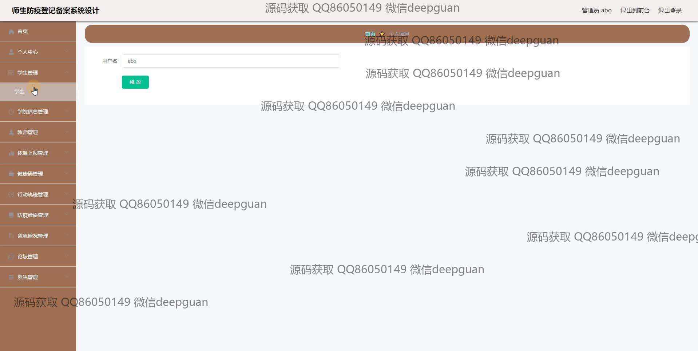
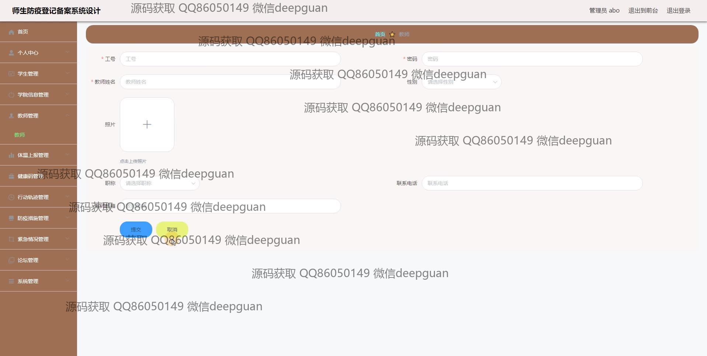
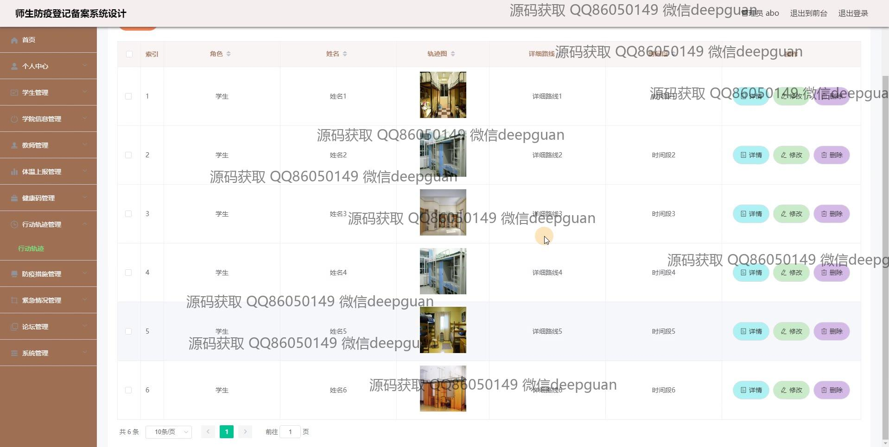
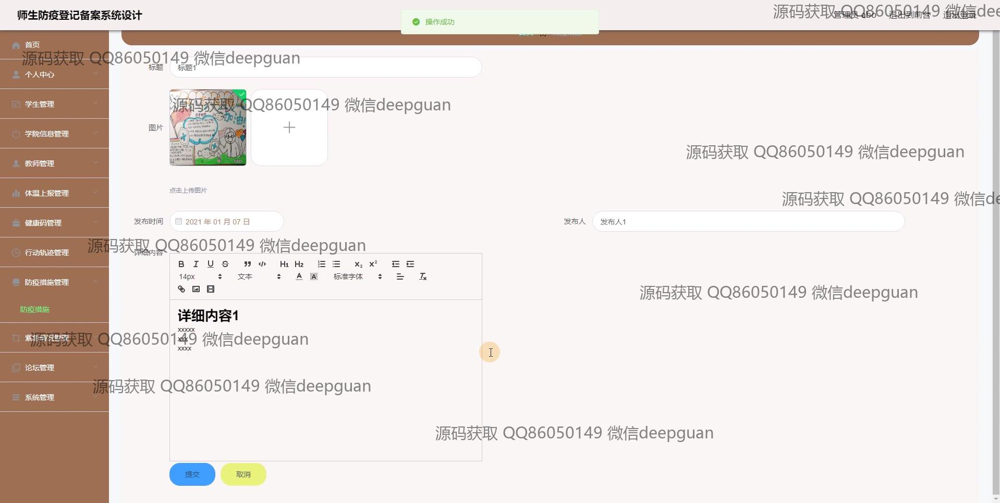
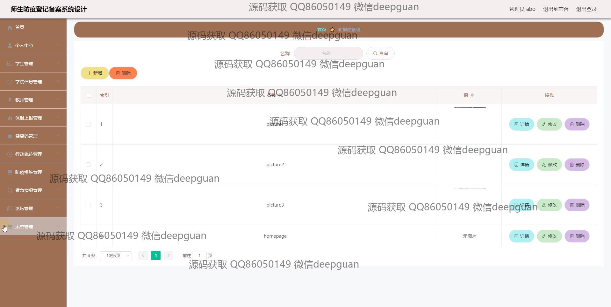
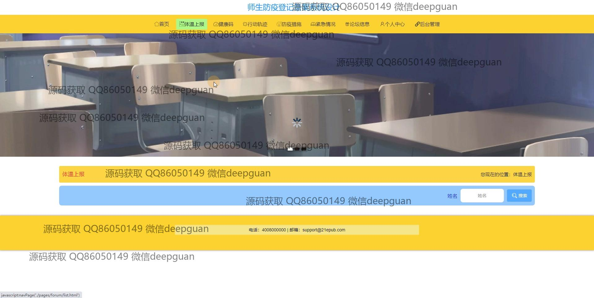
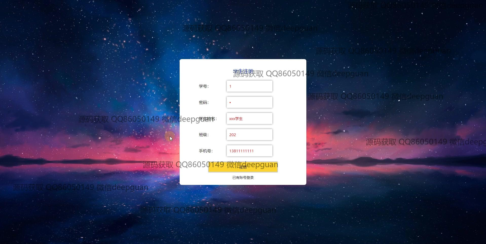
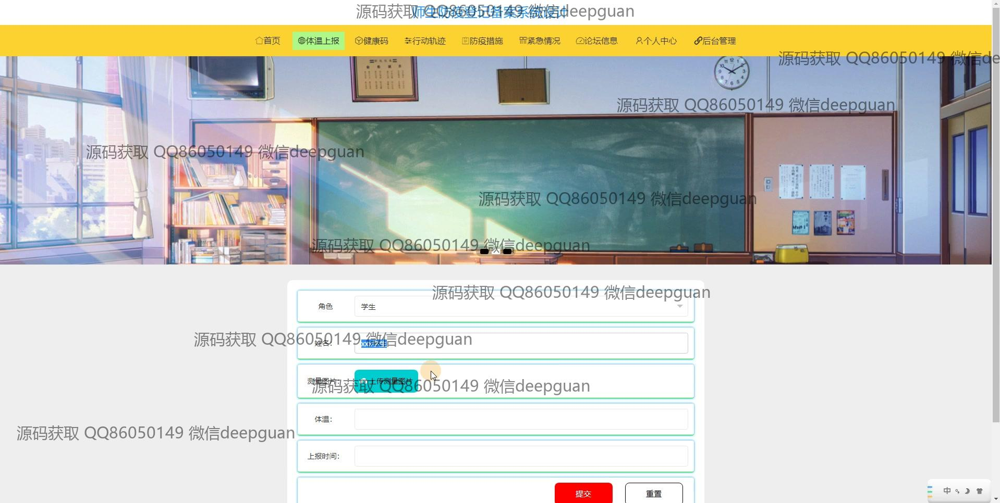
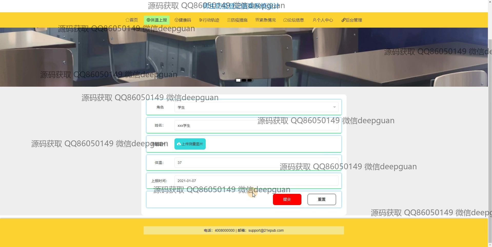
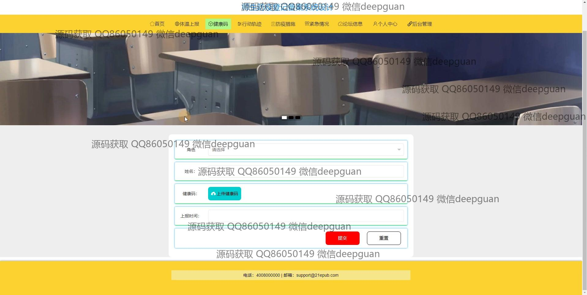
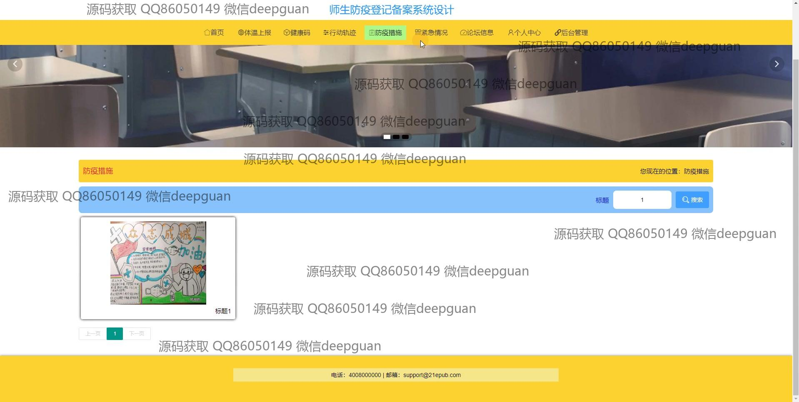
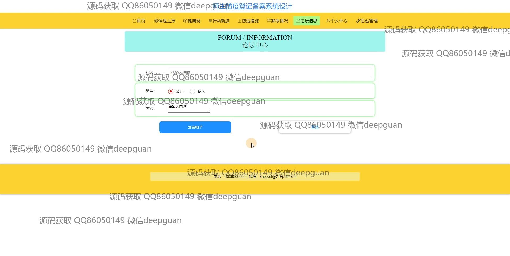
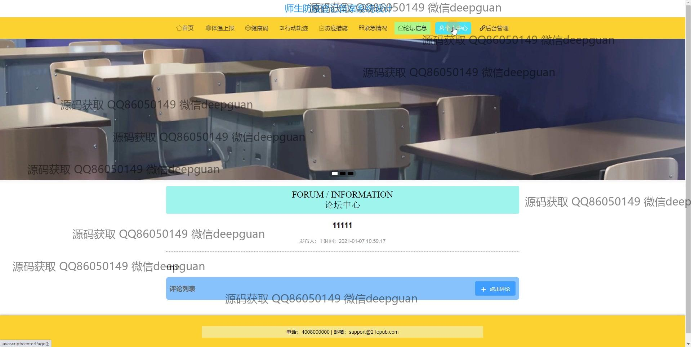
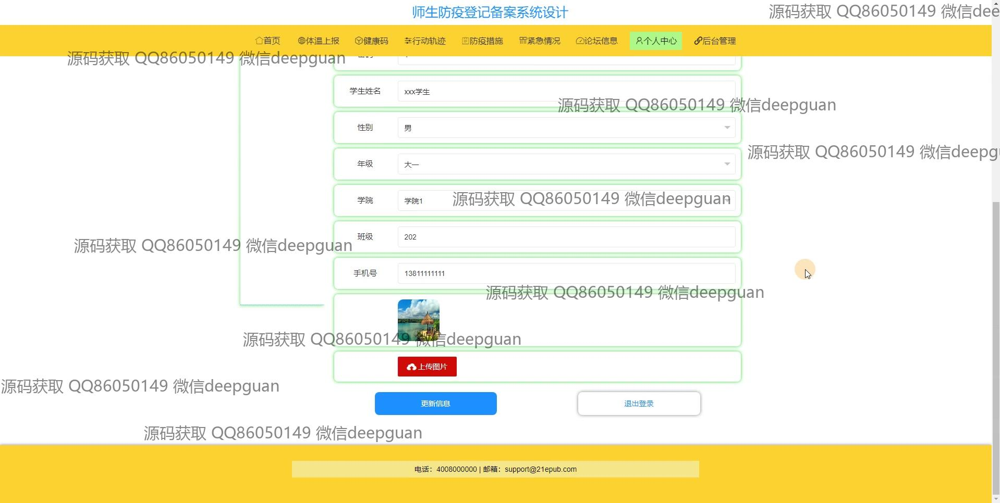
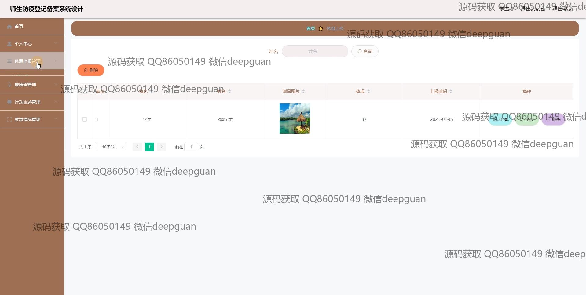
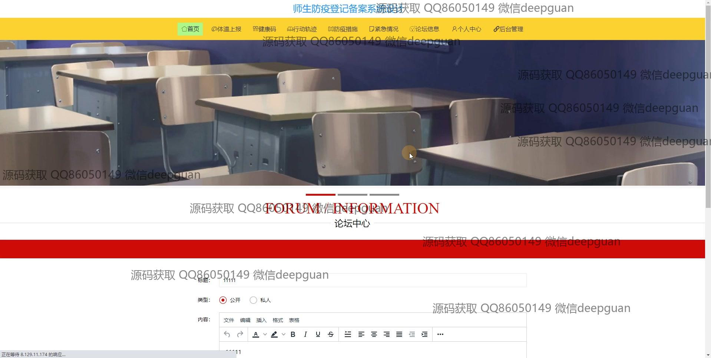

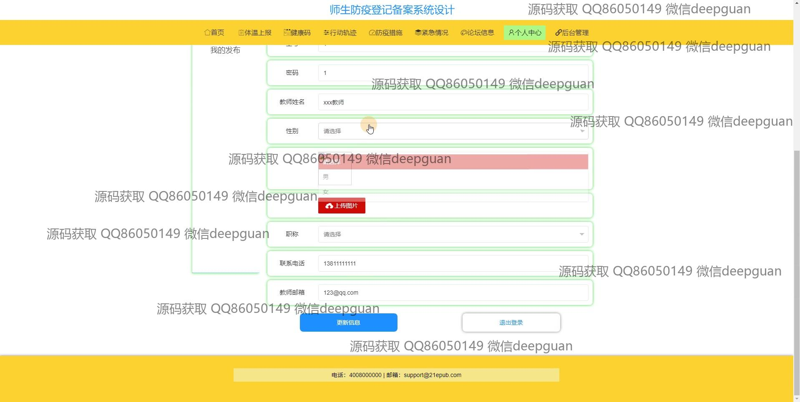
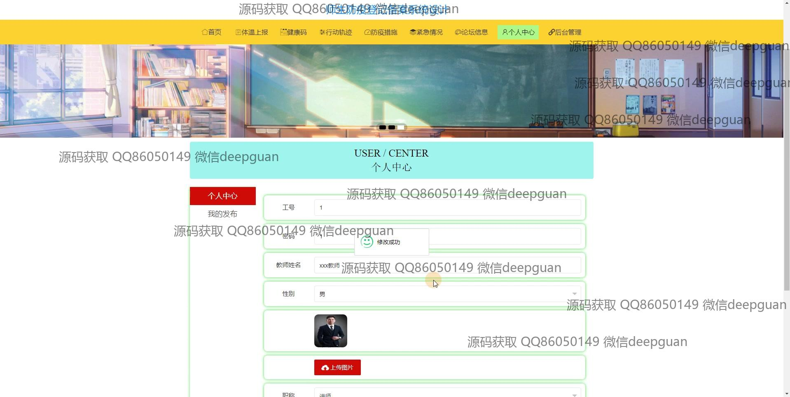
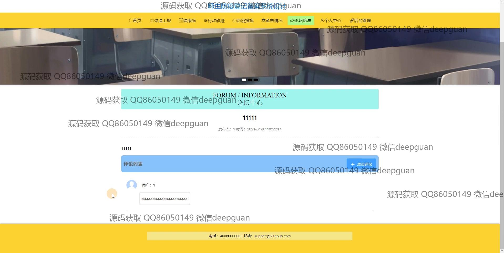
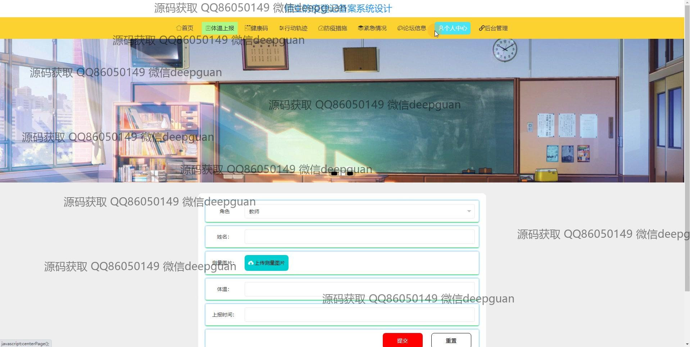
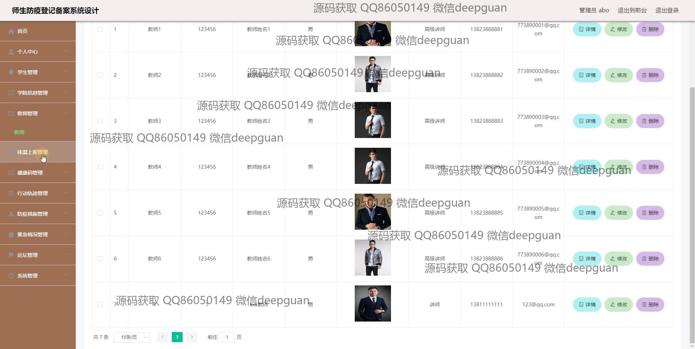

本代码来源于网络,仅供学习参考使用!

